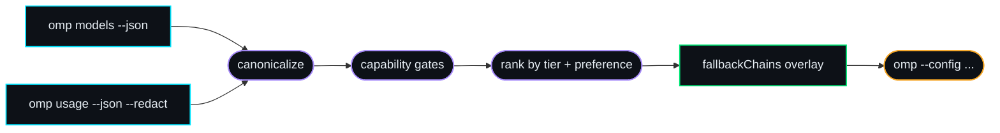

```text
 ██████  ███    ███ ██████         ██████   ██████  ██    ██ ████████ ███████
██    ██ ████  ████ ██   ██        ██   ██ ██    ██ ██    ██    ██    ██
██    ██ ██ ████ ██ ██████  ██████ ██████  ██    ██ ██    ██    ██    █████
██    ██ ██  ██  ██ ██             ██   ██ ██    ██ ██    ██    ██    ██
 ██████  ██      ██ ██             ██   ██  ██████   ██████     ██    ███████

────────────────────────────────────────────────────────────────────────────
 routing plan compiler for Oh My Pi   ::   discover → gate → rank → compile
────────────────────────────────────────────────────────────────────────────
```

<p align="center">
  <strong>Keep the task moving when a provider stops.</strong><br />
  Discover equivalent models, rank available providers, and compile safe fallback chains for Oh My Pi.
</p>

<p align="center">
  <a href="https://github.com/Nigmat-future/omp-route/blob/main/LICENSE"></a>
  
  
  <a href="https://github.com/Nigmat-future/omp-route/actions/workflows/ci.yml"></a>
  <a href="https://github.com/Nigmat-future/omp-route/actions/workflows/codeql.yml"></a>
  
</p>

<p align="center">
  <a href="#01--the-problem"><b>Problem</b></a> ·
  <a href="#02--quick-start"><b>Quick start</b></a> ·
  <a href="#03--how-it-works"><b>How it works</b></a> ·
  <a href="#04--routing-policy"><b>Policy</b></a> ·
  <a href="#06--command-reference"><b>Reference</b></a> ·
  <a href="#07--safety-model"><b>Safety</b></a>
</p>

<br />

<p align="center">
  
</p>

<details>
<summary><b>&nbsp;⌗&nbsp;&nbsp;Same transcript as copyable text</b></summary>
<br />

```console
$ omp-route explain cctq-claude/claude-fable-5 --prefer cursor,cctq-claude,openrouter

Generated 1 fallback route.

source: cctq-claude/claude-fable-5 (claude-fable@5)
  1. cursor/claude-fable-5 — preference #1, 100% quota remaining
  2. openrouter/anthropic/claude-fable-5 — preference #3, quota unknown
  3. glm-fireworks/anthropic/claude-fable-5 — quota unknown
```

Recorded against a stub OMP that speaks the same JSON contract as the real CLI; regenerate the animation with `node tools/make-demo-svg.mjs`.

</details>

> [!NOTE]
> **OMP owns execution. `omp-route` only decides the order.**
> It is not a proxy and never sits between OMP and a model provider.

<br />

## `01` · The problem

[Oh My Pi](https://github.com/can1357/oh-my-pi) already knows how to retry requests, cool down unhealthy providers, and follow `retry.fallbackChains`. What it cannot infer is that differently named selectors may represent the same model:

```text
        cctq-claude/claude-fable-5   ┐
        cursor/claude-fable-5-high   ├──  one model · three names · zero linkage
 openrouter/anthropic/claude-fable-5 ┘
```

Without a chain, an exhausted provider still leaves you switching models by hand. `omp-route` supplies the missing planning layer.

<table>
<tr><th align="left">Manual setup</th><th align="left">With <code>omp-route</code></th></tr>
<tr><td>Find matching models provider by provider</td><td><b>Read the catalog directly from OMP</b></td></tr>
<tr><td>Compare provider-specific model IDs</td><td><b>Group conservative canonical equivalents</b></td></tr>
<tr><td>Hand-author every fallback chain</td><td><b>Generate a chain for every selectable variant</b></td></tr>
<tr><td>Reorder providers as quota changes</td><td><b>Rank from redacted usage data at launch</b></td></tr>
<tr><td>Modify the main OMP configuration</td><td><b>Write a separate, reversible overlay</b></td></tr>
</table>

## `02` · Quick start

### Requirements

| | |
| --- | --- |
| **Runtime** | [Node.js](https://nodejs.org/) 22 or newer |
| **Peer CLI** | [OMP](https://github.com/can1357/oh-my-pi) installed and available as `omp` |
| **Network** | none — planning happens entirely on your machine |

### Install from GitHub

`omp-route` is not published to the npm registry. Install it directly from this repository:

```console
$ npm install --global github:Nigmat-future/omp-route
$ omp-route --help
```

Or clone and run it locally:

```console
$ git clone https://github.com/Nigmat-future/omp-route.git
$ cd omp-route
$ node bin/omp-route.js --help
```

### Build your first route

```console
$ # [1] inspect high-confidence cross-provider groups
$ omp-route scan fable

$ # [2] preview the exact fallback chains
$ omp-route plan --match fable --prefer cursor,cctq-claude,openrouter

$ # [3] see why each candidate received its position
$ omp-route explain cctq-claude/claude-fable-5 \
      --prefer cursor,cctq-claude,openrouter

$ # [4] compile the overlay and launch OMP with your original arguments
$ omp-route run --match fable \
      --prefer cursor,cctq-claude,openrouter \
      -- --model fable
```

Step `[4]` writes `~/.omp-route/routes.generated.yml`, then hands control over:

```console
$ omp --config ~/.omp-route/routes.generated.yml --model fable
```

Your existing OMP configuration is not edited.

## `03` · How it works



The planner runs **once**, immediately before OMP starts:

| # | Stage | What happens |
| :-: | --- | --- |
| 1 | **Discover** | Read OMP's public model catalog and best-effort, redacted usage report |
| 2 | **Canonicalize** | Normalize known provider-specific selectors without collapsing ambiguous versions |
| 3 | **Gate** | Reject candidates that lose required reasoning support, context length, or input modalities |
| 4 | **Rank** | Prefer usable quota tiers, then your provider preference within each tier |
| 5 | **Compile** | Emit an explicit chain for every selectable model in every cross-provider group |
| 6 | **Delegate** | Launch OMP and leave retries, cooldowns, and fallback reversion to its runtime |

> [!TIP]
> If usage reporting is unavailable, planning continues from compatibility and `--prefer` instead of failing the task.

## `04` · Routing policy

The policy is intentionally conservative. **A missed route is safer than silently replacing a model with the wrong one.**

```text
availability ladder
┌─ tier 1 ─ known quota > 5% ──────────────► preferred
├─ tier 2 ─ quota unknown ─────────────────►
├─ tier 3 ─ positive quota ≤ 5% ───────────►
└─ tier 4 ─ exhausted ─────────────────────► last resort
   └─ within a tier:  --prefer order  →  remaining quota  →  provider name
```

| Stage | Decision rule |
| --- | --- |
| **Identity** | Claude family and version are normalized explicitly; generic models require the same final model ID |
| **Ambiguity** | `latest` aliases, batch-only variants, conflicting identities, and missing IDs are excluded |
| **Versioning** | Fable 5 and Fable 5.1 remain separate canonical groups |
| **Capability** | A fallback must preserve reasoning support, context window, and every required input modality |
| **Profile** | Matching thinking profiles are preferred; configurable profiles are forwarded as selector suffixes |
| **Availability** | Known quota above 5% → unknown quota → low positive quota at 5% or below → exhausted |
| **Preference** | Inside one availability tier, `--prefer` order wins, followed by remaining quota and provider name |
| **Disabled credentials** | Removed from fallback candidates entirely |

## `05` · Generated overlay

The `.yml` file uses JSON syntax, which is valid YAML and unambiguous to serialize:

```json
{
  "retry": {
    "enabled": true,
    "modelFallback": true,
    "fallbackRevertPolicy": "cooldown-expiry",
    "fallbackChains": {
      "cctq-claude/claude-fable-5": [
        "cursor/claude-fable-5-high",
        "openrouter/anthropic/claude-fable-5"
      ]
    }
  }
}
```

Only retry settings are included in the overlay. Unrelated OMP settings remain untouched.

## `06` · Command reference

| Command | Purpose |
| --- | --- |
| `omp-route scan [query]` | List routable canonical groups spanning multiple providers |
| `omp-route plan [options]` | Preview all generated chains without writing a file |
| `omp-route explain [query] [options]` | Show ordering reasons for matching routes |
| `omp-route run [options] -- [OMP_ARGS...]` | Write the overlay and launch OMP with forwarded arguments |

| Option | Applies to | Description |
| --- | --- | --- |
| `--match <query>` | `plan` `explain` `run` | Limit discovery to matching canonical keys, selectors, or model names |
| `--prefer <a,b,...>` | `plan` `explain` `run` | Set provider priority within the same availability tier |
| `--profile <name>` | `plan` `explain` `run` | Preferred thinking profile when a source has no explicit profile; default is `high` |
| `--json` | `scan` `plan` `explain` | Print machine-readable output |
| `--all` | `run` | Allow an unscoped overlay even when it exceeds the automatic route guard |
| `--` | `run` | Forward every following argument to OMP unchanged |

For `run`, a passthrough `--model` value is also used as the route scope when `--match` is omitted.

<details>
<summary><b>&nbsp;⚙&nbsp;&nbsp;Environment variables</b></summary>
<br />

| Variable | Purpose |
| --- | --- |
| `OMP_ROUTE_DIR` | Override the directory containing `routes.generated.yml` |
| `OMP_ROUTE_OMP_COMMAND` | Override the OMP executable name or path |
| `OMP_ROUTE_OMP_PREFIX_ARGS` | JSON string array prepended to OMP arguments; mainly useful for wrappers and tests |

</details>

## `07` · Safety model

| | Guarantee |
| :-: | --- |
| **`local`** | The planner does not call model-provider APIs or proxy model traffic; it invokes the locally installed OMP CLI. |
| **`redacted`** | Usage is requested with OMP's `--redact` flag. Error output is additionally scrubbed for API-key and bearer-token patterns. |
| **`reversible`** | The generated overlay is separate from the user's OMP config and requests file mode `0600` where supported. |
| **`fail-closed`** | Invalid model-discovery JSON stops execution before OMP is launched. |
| **`bounded`** | Unscoped plans above 200 routes are refused unless the user passes `--all`. |
| **`no-shell`** | OMP is spawned without a shell and receives passthrough arguments as an array. |

The full threat model, including what is explicitly out of scope, lives in [SECURITY.md](SECURITY.md). Vulnerabilities go through [private advisories](https://github.com/Nigmat-future/omp-route/security/advisories/new), not public issues.

> [!IMPORTANT]
> `omp-route` is a proof of concept. Review `plan` output before relying on a new model family in unattended workloads.

## `08` · Boundaries

`omp-route` **deliberately does not**:

```diff
- proxy, stream, or issue model-generation requests
- migrate a request that is already mid-stream
- continuously re-plan routes during a running OMP session
- guarantee semantic equivalence for arbitrary or ambiguous model names
- replace OMP's retry classifier, cooldown handling, or runtime fallback logic
```

A real transition still depends on OMP classifying the provider response as retryable and on the provider returning a recognizable quota or availability error.

## `09` · Development

```console
$ git clone https://github.com/Nigmat-future/omp-route.git
$ cd omp-route
$ npm test
```

The suite uses Node's built-in test runner and covers canonicalization, compatibility, quota ranking, CLI behavior, overlay generation, argument forwarding, degraded usage reporting, and malformed discovery output. There are no runtime dependencies.

Every push runs the suite on Node 22 and 24, across Linux and Windows, plus a CodeQL analysis and a guard that fails the build if a runtime dependency is ever added.

| Path | What lives there |
| --- | --- |
| `src/core.js` | Canonicalization, compatibility gates, ranking, overlay shape |
| `src/omp.js` | The only place that spawns OMP, and the output redaction |
| `src/cli.js` | Argument parsing, output formatting, the route guard |
| `tools/make-demo-svg.mjs` | Regenerates the animated terminal in the README |

Issues and focused pull requests are welcome — please use a conventional commit prefix (`feat:`, `fix:`, `docs:`) in the PR title, since releases and the changelog are generated from them.

<br />

<p align="center">
  Released under the <a href="LICENSE"><b>MIT License</b></a> · built for <a href="https://github.com/can1357/oh-my-pi"><b>Oh My Pi</b></a>
</p>

<p align="center">
  <code>discover → gate → rank → compile → delegate</code>
</p>
